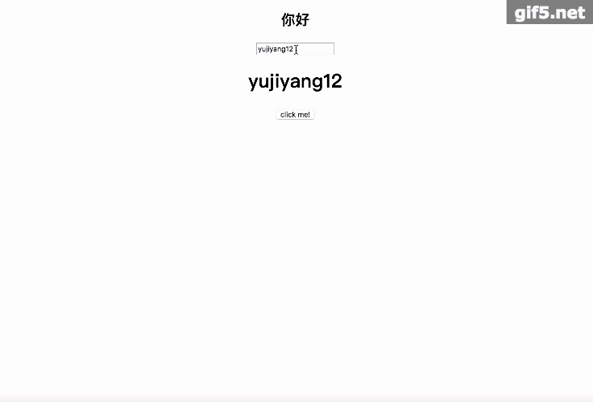
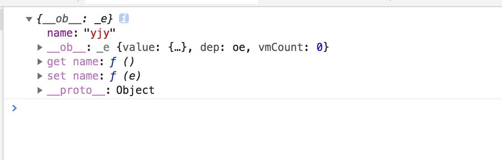
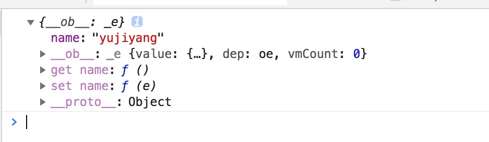
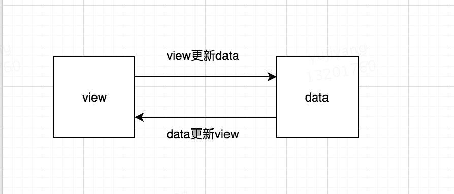
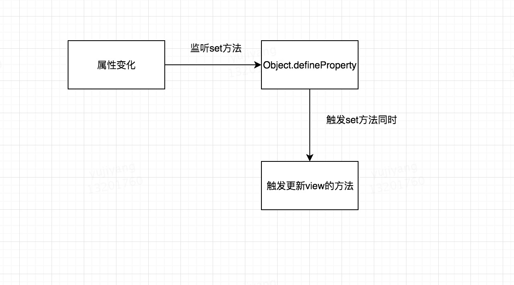
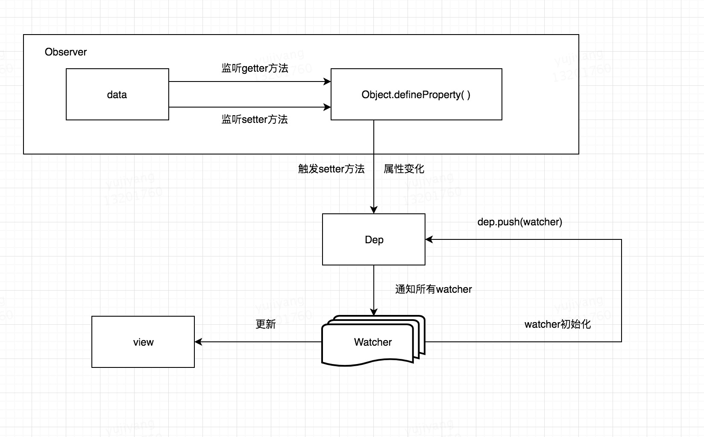
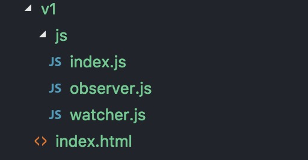
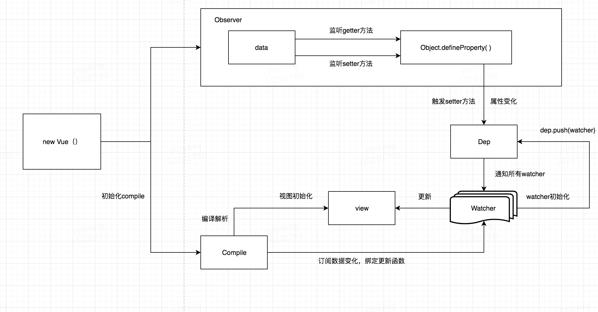

# data-binding
简单版vue的双向绑定实现

## 成果图


## vue实现
上诉成果用vue来实现其实很简单，我们先创建一个文件夹v0，在v0文件夹内见一个index.html:
````html
<!DOCTYPE html>
<html lang="en">
<head>
    <meta charset="UTF-8">
    <title>data-binding</title>
</head>
<style>
    #app {
        text-align: center;
    }
</style>
<body>
    <div id="app">
        <h2>{{title}}</h2>
        <input v-model="name">
        <h1>{{name}}</h1>
        <button v-on:click="clickMe">click me!</button>
    </div>
</body>
<!-- vue源码cdn地址  https://cn.vuejs.org/v2/guide/ -->
<script src="https://cdn.jsdelivr.net/npm/vue"></script>
<script type="text/javascript">

     new Vue({
        el: '#app',
        data: {
            title: 'hello world',
            name: 'yujiyang'
        },
        methods: {
            clickMe: function () {
                this.title = 'hello world';
            }
        },
        mounted: function () {
            window.setTimeout(() => {
                this.title = '你好';
            }, 1000);
        }
    });

</script>
</html>
````
那么vue是怎么实现的呢？
- 数据双向绑定
- {{ }}双括号变量解析
- v-model和事件指令解析

现在从简到难一步一步来实现这个'vue'。
ps：由于本文只是为了学习和分享，所以只是简单实现下原理，并没有考虑太多情况和设计，如果大家有什么建议，欢迎提出来。

### vue数据双向绑定原理
看过vue的源码的同学都知道，vue是通过**数据劫持**结合**发布者-订阅者模式**的方式来实现的～

首先来看下vue是如何进行数据劫持的？
````javascript
new Vue({
    el: '#app',
    data: {
        message: {
            name:'yjy',
        }
    },
    created: function () {
        console.log(this.message);
    }
});
````
结果：



我们可以看到属性name有两个相对应的get和set方法，为什么会多出这两个方法呢？因为vue是通过**Object.defineProperty()**来实现数据劫持的。

Object.defineProperty( )是用来做什么的？它可以来控制一个对象属性的一些特有操作，比如读写权、是否可以枚举，这里我们主要先来研究下它对应的两个描述属性get和set，如果还不熟悉其用法，[请点击这里阅读更多用法](https://developer.mozilla.org/zh-CN/docs/Web/JavaScript/Reference/Global_Objects/Object/defineProperty)。

举个例子：
````javascript
var People = {
  name: 'jiyang'
};
console.log(People.name);  // yjy
````
如果我们想要在执行console.log(People.name)的同时，直接给名字加个姓，那要怎么处理呢？或者说要通过什么监听对象People的属性值。这时候Object.defineProperty( )就派上用场了，代码如下：
````javascript
var People = {}
var name = '';
Object.defineProperty(People, 'name', {
  set: function (value) {
    name = value;
    console.log('你取了一个名叫做' + value);
  },
  get: function () {
    return 'yu' + name 
  }
})
 
People.name = 'jiyang';  // 你取了一个名叫做jiyang
console.log(People.name);  // yujiyang
````
我们通过Object.defineProperty( )设置了对象People的name属性，对其get和set进行重写操作，顾名思义，get就是在读取name属性这个值触发的函数，set就是在设置name属性这个值触发的函数，所以当执行 People.name = 'jiyang' 这个语句时，控制台会打印出 "你取了一个名叫做jiyang"，紧接着，当读取这个属性时，就会输出 "yujiyang"，因为我们在get函数里面对该值做了加工了。如果这个时候我们执行下下面的语句，控制台会输出什么？
````javascript
console.log(People)
````
结果：



是不是跟我们在上面打印vue数据长得有点类似，这也进一步验证vue确实是通过这种方法来进行数据劫持的。接下来我们通过其原理来实现一个简单版的mvvm双向绑定代码。

### mvvm思路分析
实现mvvm主要包含两个方面，数据变化更新视图，视图变化更新数据：



view更新data其实可以通过事件监听即可，比如input标签监听 'input' 事件就可以实现了。所以我们着重来分析下，当数据改变，如何更新视图的？

其实上文我们已经给出答案了，就是通过Object.defineProperty()对属性设置一个set函数，当数据改变了就会来触发这个函数，所以我们只要将一些需要更新的方法放在这里面就可以实现data更新view了。



现在思路有了，接下去就是实现过程了。

### 实现过程

#### 监听器Observer
首先我们需要实现一个数据监听器Observer，用来监听所有属性，如果属性发上变化了，就执行相应方法。
````javascript
function defineReactive(data, key, val) {
    observe(val); // 递归遍历所有子属性
    Object.defineProperty(data, key, {
        enumerable: true,
        configurable: true,
        get: function() {
            return val;
        },
        set: function(newVal) {
            val = newVal;
            console.log('属性' + key + '已经被监听了，现在值为：“' + newVal.toString() + '”');
        }
    });
}
 
function observe(data) {
    if (!data || typeof data !== 'object') {
        return;
    }
    Object.keys(data).forEach(function(key) {
        defineReactive(data, key, data[key]);
    });
};
 
var people = {
    person1: {
        name: ''
    },
    person2: ''
};
observe(people);
people.person1.name = 'yjy'; // 属性name已经被监听了，现在值为：“yjy”
people.person2 = '没有此人';  // 属性person2已经被监听了，现在值为：“没有此人”
````

#### 订阅器Dep与订阅者Watcher
由于一个属性的getter可能在多处触发（也就是被多个dom使用），所以属性setter的时候需要执行多个改变view的方法，我们把通知执行一个改变view的方法抽象成一个订阅者Watcher。有一个容器来专门收集Watcher，叫做订阅器Dep。

Watcher初始化的时候，添加一个Watcher到Dep。
属性每次setter的时候，执行Dep中所有Watcher。



有了这个思路我们结合observer，来实现一下Dep和Watcher
````javascript
// observer.js
// observer+dep
function Observer(data) {
    this.data = data;
    this.walk(data);
}
Observer.prototype = {
    walk: function(data) {
        var self = this;
        Object.keys(data).forEach(function(key) {
            self.defineReactive(data, key, data[key]);
        });
    },
    defineReactive: function(data, key, val) {
        var dep = new Dep();
        var childObj = observe(val);
        Object.defineProperty(data, key, {
            enumerable: true,
            configurable: true,
            get: function() {
                if (Dep.target) {
                    dep.addSub(Dep.target);
                }
                return val;
            },
            set: function(newVal) {
                if (newVal === val) {
                    return;
                }
                val = newVal;
                dep.notify();
            }
        });
    }
};

function observe(value, vm) {
    if (!value || typeof value !== 'object') {
        return;
    }
    return new Observer(value);
};

function Dep () {
    this.subs = [];
}
Dep.prototype = {
    addSub: function(sub) {
        this.subs.push(sub);
    },
    notify: function() {
        this.subs.forEach(function(sub) {
            sub.update();
        });
    }
};
Dep.target = null;
````
````javascript
// watcher.js
function Watcher(vm, exp, cb) {
    this.cb = cb;
    this.vm = vm;
    this.exp = exp;
    this.value = this.get();  // 将自己添加到订阅器的操作
}

Watcher.prototype = {
    update: function() {
        this.run();
    },
    run: function() {
        var value = this.vm.data[this.exp];
        var oldVal = this.value;
        if (value !== oldVal) {
            this.value = value;
            this.cb.call(this.vm, value, oldVal);
        }
    },
    get: function() {
        Dep.target = this;  // 缓存自己
        var value = this.vm.data[this.exp]  // 强制执行监听器里的get函数
        Dep.target = null;  // 释放自己
        return value;
    }
};
````
#### ‘vue’的v1版本
了解了Observer、Dep、Watcher后，我们只要将Observer和Watcher关联起来，就可以实现一个简单的数据双向绑定了。因为这里没有还没有设计解析器Compile，所以对于模板绑定的属性数据,我们都进行写死处理，假设模板上有一个节点，且id号为'name'，并且双向绑定的绑定的变量也为'name'，且是通过两个大双括号包起来（这里只是为了掩饰，暂时没什么用处）。

先建立一个文件夹v1，目录结构如下：



observer和watcher我们已经实现，还需要实现一个关联Observer和Watcher的index.js和模板index.html

````html
<!--index.html-->
<!DOCTYPE html>
<html lang="en">
<head>
    <meta charset="UTF-8">
    <title>self-vue</title>
</head>
<style>
    #name {
        text-align: center;
    }
</style>
<body>
    <h1 id="name"></h1>
</body>
<script src="js/observer.js"></script>
<script src="js/watcher.js"></script>
<script src="js/index.js"></script>
<script type="text/javascript">

    var ele = document.querySelector('#name');
    var vue = new Vue({
        name: 'hello world'
    }, ele, 'name');

    window.setTimeout(function () {
        console.log('name值改变了');
        vue.name = 'yjy';
    }, 2000);

</script>
</html>
````
````javascript
// index.js
function Vue (data, el, exp) {
    var self = this;
    this.data = data;

    // 知道为什么还要这个操作？？？
    Object.keys(data).forEach(function(key) {
        self.proxyKeys(key);
    });

    observe(data);
    el.innerHTML = this.data[exp];  // 初始化模板数据的值
    new Watcher(this, exp, function (value) {
        el.innerHTML = value;
    });
    return this;
}

Vue.prototype = {
    proxyKeys: function (key) {
        var self = this;
        Object.defineProperty(this, key, {
            enumerable: false,
            configurable: true,
            get: function proxyGetter() {
                return self.data[key];
            },
            set: function proxySetter(newVal) {
                self.data[key] = newVal;
            }
        });
    }
}
````

#### 解析器Compile

虽然上面已经实现了一个双向数据绑定的例子，但是整个过程都没有去解析dom节点，而是直接固定某个节点进行替换数据的，所以接下来需要实现一个解析器Compile来做解析和绑定工作。

解析器Compile实现步骤：

1. 解析模板指令，并替换模板数据，初始化视图
2. 将模板指令对应的节点绑定对应的更新函数，初始化相应的订阅器



为了解析模板，首先需要获取到dom元素，然后对含有dom元素上**含有指令**的节点进行处理，因此这个环节需要对dom操作比较频繁，所有可以先建一个fragment片段，将需要解析的dom节点存入fragment片段里再进行处理：

````javascript
function nodeToFragment (el) {
    var fragment = document.createDocumentFragment();
    var child = el.firstChild;
    while (child) {
        // 将Dom元素移入fragment中
        fragment.appendChild(child);
        child = el.firstChild
    }
    return fragment;
}
````

接下来需要遍历各个节点，对含有相关指定的节点进行特殊处理，这里咱们先处理最简单的情况，只对带有 '{{变量}}' 这种形式的指令进行处理，后面再考虑更多指令情况：

````javascript
function compileElement (el) {
    var childNodes = el.childNodes;
    var self = this;
    [].slice.call(childNodes).forEach(function(node) {
        var reg = /\{\{(.*)\}\}/;
        var text = node.textContent; //获取该节点以及其子节点所包含文本内容
 
        if (self.isTextNode(node) && reg.test(text)) {  // 判断是否是符合这种形式{{}}的指令且节点类型是文本类型
            self.compileText(node, reg.exec(text)[1]);
        }
 
        if (node.childNodes && node.childNodes.length) {
            self.compileElement(node);  // 继续递归遍历子节点
        }
    });
},
function compileText (node, exp) {
    var self = this;
    var initText = this.vm[exp];
    this.updateText(node, initText);  // 将初始化的数据初始化到视图中
    new Watcher(this.vm, exp, function (value) {  // 生成订阅器并绑定更新函数
        self.updateText(node, value);
    });
},
function updateText (node, value) {
    node.textContent = typeof value == 'undefined' ? '' : value;
},
function isTextNode (node) {
    return node.nodeType == 3;
}
````

获取到最外层节点后，调用compileElement函数，对所有子节点进行判断，如果节点是文本节点且匹配{{}}这种形式指令的节点就开始进行编译处理，编译处理首先需要初始化视图数据，对应上面所说的步骤1，接下去需要生成一个并绑定更新函数的订阅器，对应上面所说的步骤2。这样就完成指令的解析、初始化、编译三个过程，一个解析器Compile也就可以正常的工作了。为了将解析器Compile与监听器Observer和订阅者Watcher关联起来，我们需要再修改一下‘Vue类’：

````javascript
// index.js
function Vue (options) {
    var self = this;
    this.vm = this;
    this.data = options.data;

    Object.keys(this.data).forEach(function(key) {
        self.proxyKeys(key);
    });

    observe(this.data);
    new Compile(options.el, this.vm); // 初始化视图和watcher初始化都封装在compile里面
    return this;
}

Vue.prototype = {
    proxyKeys: function (key) {
        var self = this;
        Object.defineProperty(this, key, {
            enumerable: false,
            configurable: true,
            get: function proxyGetter() {
                return self.data[key];
            },
            set: function proxySetter(newVal) {
                self.data[key] = newVal;
            }
        });
    }
}

````
更改后，我们就不要像之前通过传入固定的元素值进行双向绑定了，只要传入一个根节点就可以对所有子节点进行双向绑定了：

````html
<body>
    <div id="app">
        <h2>{{title}}</h2>
        <h1>{{name}}</h1>
    </div>
</body>
<script src="js/observer.js"></script>
<script src="js/watcher.js"></script>
<script src="js/compile.js"></script>
<script src="js/index.js"></script>
<script type="text/javascript">
 
    var Vue = new Vue({
        el: '#app',
        data: {
            title: 'hello world',
            name: 'ddvdd'
        }
    });
 
    window.setTimeout(function () {
        Vue.title = '你好';
    }, 2000);
 
    window.setTimeout(function () {
        Vue.name = 'yjy';
    }, 2500);
 
</script>
````

完整的Compile.js代码如下：
````javascript
function Compile(el, vm) {
    this.vm = vm;
    this.el = document.querySelector(el);
    this.fragment = null;
    this.init();
}

Compile.prototype = {
    init: function () {
        if (this.el) {
            this.fragment = this.nodeToFragment(this.el);
            this.compileElement(this.fragment);
            this.el.appendChild(this.fragment);
        } else {
            console.log('Dom元素不存在');
        }
    },
    nodeToFragment: function (el) {
        var fragment = document.createDocumentFragment();
        var child = el.firstChild;
        while (child) {
            // 将Dom元素移入fragment中
            fragment.appendChild(child);
            child = el.firstChild
        }
        return fragment;
    },
    compileElement: function (el) {
        var childNodes = el.childNodes;
        var self = this;
        [].slice.call(childNodes).forEach(function(node) {
            var reg = /\{\{(.*)\}\}/;
            var text = node.textContent;

            if (self.isTextNode(node) && reg.test(text)) {  // 判断是否是符合这种形式{{}}的指令
                self.compileText(node, reg.exec(text)[1]);
            }

            if (node.childNodes && node.childNodes.length) {
                self.compileElement(node);  // 继续递归遍历子节点
            }
        });
    },
    compileText: function(node, exp) {
        var self = this;
        var initText = this.vm[exp];
        this.updateText(node, initText);  // 将初始化的数据初始化到视图中
        new Watcher(this.vm, exp, function (value) { // 生成订阅器并绑定更新函数
            self.updateText(node, value);
        });
    },
    updateText: function (node, value) {
        node.textContent = typeof value == 'undefined' ? '' : value;
    },
    isTextNode: function(node) {
        return node.nodeType == 3;
    }
}
````

### 思考

到这里，一个数据双向绑定功能已经基本完成了，接下去就是需要完善更多指令的解析编译，在哪里进行更多指令的处理呢？

如何添加一个v-model指令和事件指令v-on:click的解析编译?

## 所有例子和最终思考答案
[源码地址](https://github.com/ddvdd008/data-binding)
